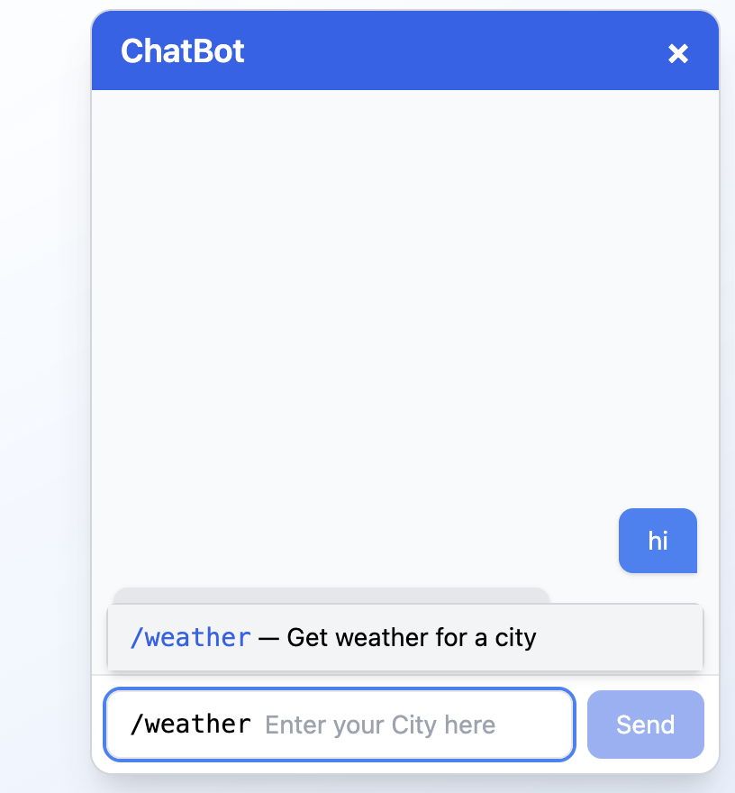

# AI-Powered Chatbot Interface with plugin-style Commands

An interactive and intelligent chatbot interface built using **React** and **TypeScript**, enhanced with smart slash command suggestions like `/weather`, `/calc`, and `/define`. This UI component mimics modern chat platforms, guiding users with auto-suggestions, intelligent command parsing, and helpful placeholder prompts.

---

## 🌐 Live Demo

🔗 **Try it here**:

### 📸 Screenshots

Here are some UI walkthroughs of the chatbot:

#### 1. Command Suggestions on Typing `/`


#### 2. Placeholder for `/weather`


#### 3. Placeholder for `/define`


#### 4. Placeholder for `/calc`


#### 5. Error for Incomplete Command



#### 6. Final Message Sent


## ✨ Features

- 🔍 **Command Suggestions** using `/`
- 💬 **Dynamic Placeholder Prompts** (e.g., `Enter your City here`)
- 🧠 **Fuzzy Matching** using Fuse.js for command suggestions
- ❌ **Command Validation** to prevent empty commands
- 🚀 **Clean and Accessible UI** built with TailwindCSS
- 🎯 Designed for extensibility (you can easily add new commands)

---

## 🚦 Available Slash Commands

| Command    | Description                  | Example Input        |
| ---------- | ---------------------------- | -------------------- |
| `/weather` | Get weather for a city       | `/weather London`    |
| `/calc`    | Evaluate a math expression   | `/calc 5 * (3 + 2)`  |
| `/define`  | Get the definition of a word | `/define innovation` |

---

## 🛠️ Getting Started

Follow these steps to set up and run the chatbot locally:

### 1. Clone the Repository

```bash
git clone https://github.com/your-username/chatbot-interface.git
cd chatbot-interface
```

### 2. Install Dependencies

npm install

### 3. Run the Development Server

npm run dev

## 🛠️🧑‍💻 How to Use the Chatbot

Follow these steps to interact with the chatbot:

### Step 1: Start Typing

Begin typing in the chat input box.

Initially, a prompt like Try typing: Hi or / will appear to guide you.

### Step 2: Use Slash "/" Commands

Type / to see a list of available commands.

Use arrow keys (↑ / ↓) or click to select a command.

### Step 3: Follow the Placeholder Guide

After selecting a command, a helpful placeholder will appear (e.g., Enter your City here).

Complete your command input, such as:

/weather London

/calc 5 \* 4

/define empathy

### Step 4: Submit your input by simply pressing enter or clicking on send button

Press Enter or click Send.

The chatbot will respond accordingly.
